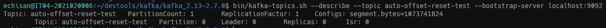
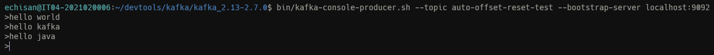
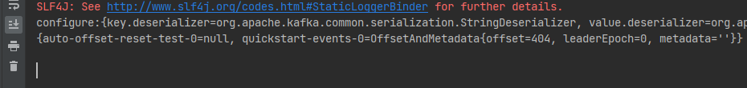
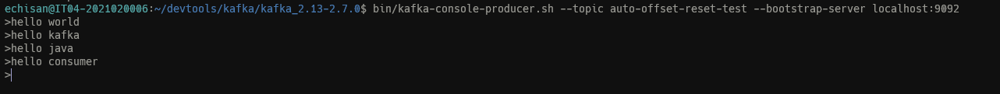
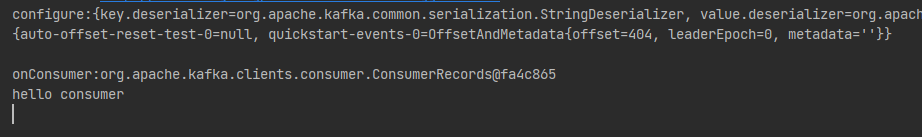
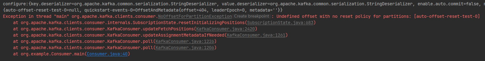

# consumer

消费者配置

## auto.offset.reset

可选参数：

> - earliest
>   当各分区下有已提交的offset时，从提交的offset开始消费；无提交的offset时，从头开始消费
> - latest
>   当各分区下有已提交的offset时，从提交的offset开始消费；无提交的offset时，消费新产生的该分区下的数据
> - none
>   topic各分区都存在已提交的offset时，从offset后开始消费；只要有一个分区不存在已提交的offset，则抛出异常


主要是用于当无提交的offset时，consumer进行消费的行为

### 测试

创建一个topic`auto-offset-reset-test`

```bash
bin/kafka-topics.sh --create --topic auto-offset-reset-test --bootstrap-server localhost:9092
```

查看topic

```bash
bin/kafka-topics.sh --describe --topic auto-offset-reset-test --bootstrap-server localhost:9092
```



往topic发送消息

```bash
bin/kafka-console-producer.sh --topic auto-offset-reset-test --bootstrap-server localhost:9092
```




#### earliest

> 当各分区下有已提交的offset时，从提交的offset开始消费；无提交的offset时，从头开始消费

consumer的配置

```java
props.put("group.id", "test-group");
props.put("enable.auto.commit", "false");
props.put("auto.offset.reset", "earliest");
props.put("max.poll.records", 1);
```


**目前没有commit信息，拉取到的是`hello world`**

将`hello world`消息进行提交

```
onConsumer:org.apache.kafka.clients.consumer.ConsumerRecords@737a135b
records size:1
hello world
onCommit:{auto-offset-reset-test-0=OffsetAndMetadata{offset=1, leaderEpoch=0, metadata=''}}
```

**将`hello world`的offset`commit`之后，拉取到的消息是`hello kafka`**

```
onConsumer:org.apache.kafka.clients.consumer.ConsumerRecords@6127a7e
records size:1
hello kafka
```

#### latest

> 当各分区下有已提交的offset时，从提交的offset开始消费；无提交的offset时，消费新产生的该分区下的数据

将`auto-offset-reset-test`删除后重新创建，也初始化`hello world, hello kafka, hello java`三条消息再进行测试

```bash
 bin/kafka-topics.sh --delete --topic auto-offset-reset-test --bootstrap-server localhost:9092
```

开启消费者，使用如下配置

```java
props.put("group.id", "test-group");
props.put("enable.auto.commit", "false");
props.put("auto.offset.reset", "latest");
props.put("max.poll.records", 1);
```



此时没有收到消息， 再发一条消息`hello consumer`, 此时收到该消息了






#### none

> topic各分区都存在已提交的offset时，从offset后开始消费；只要有一个分区不存在已提交的offset，则抛出异常

开启消费者，使用如下配置

```java
props.put("group.id", "test-group");
props.put("enable.auto.commit", "false");
props.put("auto.offset.reset", "latest");
props.put("max.poll.records", 1);
```

符合预期，抛出异常

